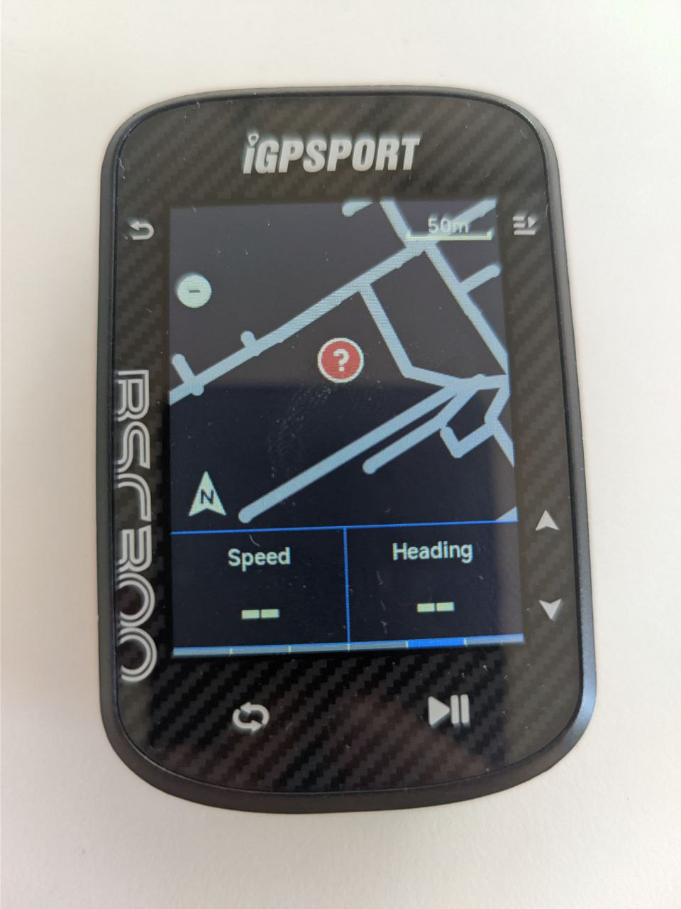
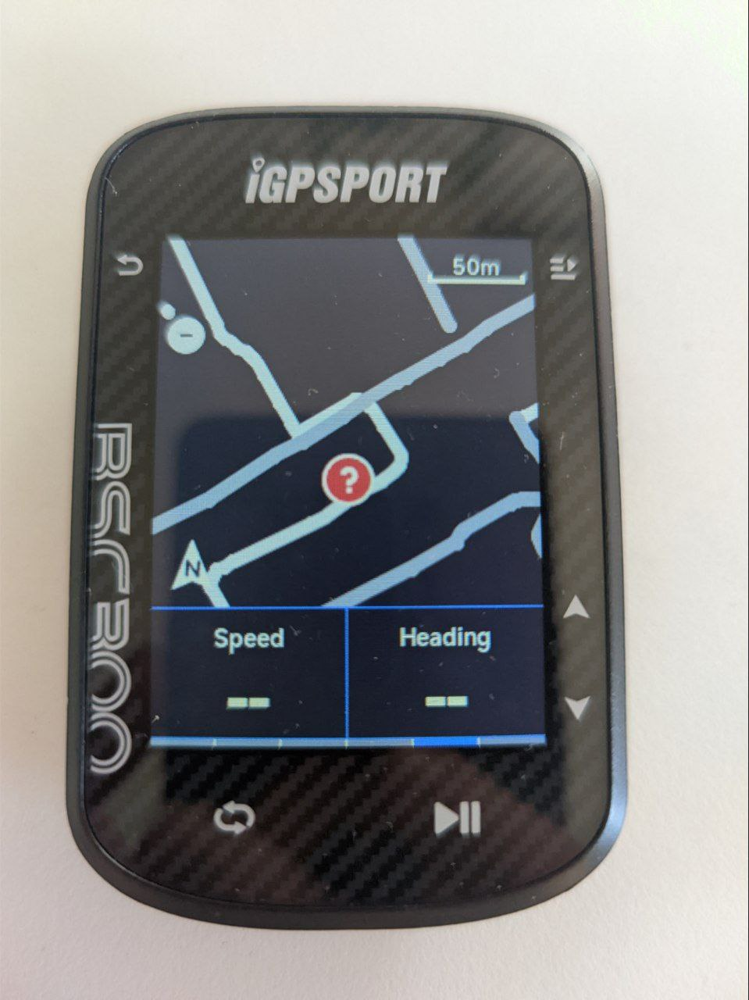
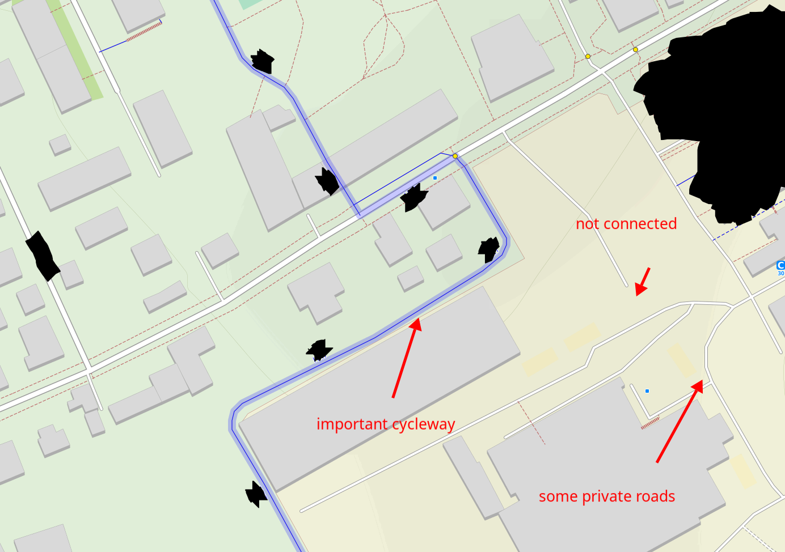
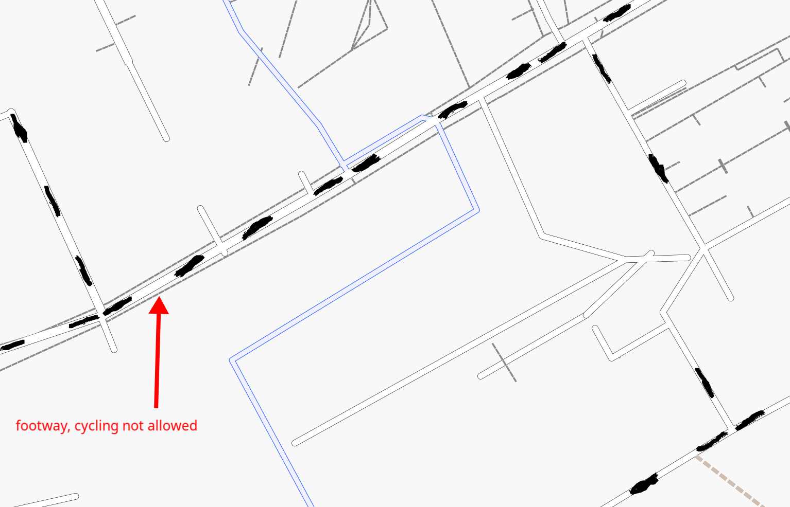
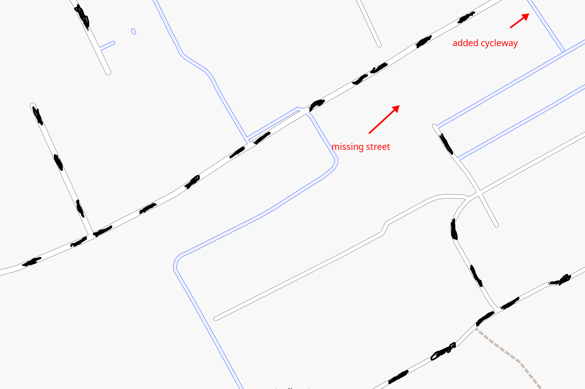

# Last Map Update: Wed Jul  1 03:22:59 UTC 2026

# [Map Downloads here](https://github.com/manujedi/BSC300-Maps/releases/) 
If [actions](https://github.com/manujedi/BSC300-Maps/actions) are running (yellow dot), maps are currently building and will be available in the next hours

[](https://github.com/manujedi/BSC300-Maps/actions/workflows/build-albania.yml)
[](https://github.com/manujedi/BSC300-Maps/actions/workflows/build-andorra.yml)
[](https://github.com/manujedi/BSC300-Maps/actions/workflows/build-austria.yml)
[](https://github.com/manujedi/BSC300-Maps/actions/workflows/build-belarus.yml)
[](https://github.com/manujedi/BSC300-Maps/actions/workflows/build-belgium.yml)
[](https://github.com/manujedi/BSC300-Maps/actions/workflows/build-bosnia-herzegovina.yml)
[](https://github.com/manujedi/BSC300-Maps/actions/workflows/build-bulgaria.yml)
[](https://github.com/manujedi/BSC300-Maps/actions/workflows/build-croatia.yml)
[](https://github.com/manujedi/BSC300-Maps/actions/workflows/build-cyprus.yml)
[](https://github.com/manujedi/BSC300-Maps/actions/workflows/build-czech-republic.yml)
[](https://github.com/manujedi/BSC300-Maps/actions/workflows/build-denmark.yml)
[](https://github.com/manujedi/BSC300-Maps/actions/workflows/build-estonia.yml)
[](https://github.com/manujedi/BSC300-Maps/actions/workflows/build-faroe-islands.yml)
[](https://github.com/manujedi/BSC300-Maps/actions/workflows/build-finland.yml)
[](https://github.com/manujedi/BSC300-Maps/actions/workflows/build-france.yml)
[](https://github.com/manujedi/BSC300-Maps/actions/workflows/build-georgia.yml)
[](https://github.com/manujedi/BSC300-Maps/actions/workflows/build-germany.yml)
[](https://github.com/manujedi/BSC300-Maps/actions/workflows/build-greece.yml)
[](https://github.com/manujedi/BSC300-Maps/actions/workflows/build-guernsey-jersey.yml)
[](https://github.com/manujedi/BSC300-Maps/actions/workflows/build-hungary.yml)
[](https://github.com/manujedi/BSC300-Maps/actions/workflows/build-iceland.yml)
[](https://github.com/manujedi/BSC300-Maps/actions/workflows/build-ireland-and-northern-ireland.yml)
[](https://github.com/manujedi/BSC300-Maps/actions/workflows/build-isle-of-man.yml)
[](https://github.com/manujedi/BSC300-Maps/actions/workflows/build-italy.yml)
[](https://github.com/manujedi/BSC300-Maps/actions/workflows/build-kosovo.yml)
[](https://github.com/manujedi/BSC300-Maps/actions/workflows/build-latvia.yml)
[](https://github.com/manujedi/BSC300-Maps/actions/workflows/build-latvia.yml)
[](https://github.com/manujedi/BSC300-Maps/actions/workflows/build-liechtenstein.yml)
[](https://github.com/manujedi/BSC300-Maps/actions/workflows/build-lithuania.yml)
[](https://github.com/manujedi/BSC300-Maps/actions/workflows/build-luxembourg.yml)
[](https://github.com/manujedi/BSC300-Maps/actions/workflows/build-macedonia.yml)
[](https://github.com/manujedi/BSC300-Maps/actions/workflows/build-malta.yml)
[](https://github.com/manujedi/BSC300-Maps/actions/workflows/build-moldova.yml)
[](https://github.com/manujedi/BSC300-Maps/actions/workflows/build-monaco.yml)
[](https://github.com/manujedi/BSC300-Maps/actions/workflows/build-montenegro.yml)
[](https://github.com/manujedi/BSC300-Maps/actions/workflows/build-netherlands.yml)
[](https://github.com/manujedi/BSC300-Maps/actions/workflows/build-norway.yml)
[](https://github.com/manujedi/BSC300-Maps/actions/workflows/build-poland.yml)
[](https://github.com/manujedi/BSC300-Maps/actions/workflows/build-portugal.yml)
[](https://github.com/manujedi/BSC300-Maps/actions/workflows/build-romania.yml)
[](https://github.com/manujedi/BSC300-Maps/actions/workflows/build-serbia.yml)
[](https://github.com/manujedi/BSC300-Maps/actions/workflows/build-slovakia.yml)
[](https://github.com/manujedi/BSC300-Maps/actions/workflows/build-slovenia.yml)
[](https://github.com/manujedi/BSC300-Maps/actions/workflows/build-spain.yml)
[](https://github.com/manujedi/BSC300-Maps/actions/workflows/build-sweden.yml)
[](https://github.com/manujedi/BSC300-Maps/actions/workflows/build-switzerland.yml)
[](https://github.com/manujedi/BSC300-Maps/actions/workflows/build-turkey.yml)
[](https://github.com/manujedi/BSC300-Maps/actions/workflows/build-ukraine.yml)
[](https://github.com/manujedi/BSC300-Maps/actions/workflows/build-united-kingdom.yml)
[](https://github.com/manujedi/BSC300-Maps/actions/workflows/build-us.yml)
[](https://github.com/manujedi/BSC300-Maps/actions/workflows/build-canada.yml)
[](https://github.com/manujedi/BSC300-Maps/actions/workflows/build-mexico.yml)
[](https://github.com/manujedi/BSC300-Maps/actions/workflows/build-greenland.yml)


Data is from openstreemap and hosted on geofabrik. Maps are under the [OpenStreetMap License](https://www.openstreetmap.org/copyright):

© OpenStreetMap contributors

Data available under the ODbL license.

for Canada/Quebec look at [michellemay fork](https://github.com/michellemay/BSC300-Maps-Canada/tree/master)

Also, look at the beautiful people behind Gadgetbridge who support this device and make it possible to use it completely offline. https://codeberg.org/Freeyourgadget/Gadgetbridge/pulls/5211

# IGPSPORT BSC300 / BSC300T Map Creator

This is a clone from https://github.com/adrianf0/bsc300_maps with an added CI step so github builds maps and ported to python for simpler math (no original code remains). If you are logged in to github you should be able to download the artifacts.
Ping me if a map update is wanted or a country should be added (or fork the repo and trigger a CI run).

It is based on the description by CYMES [source](https://www.pepper.pl/dyskusji/igpsport-bsc300-informacje-o-mapach-1046955?page=2#comments) but the maps are heavily filtered and modified.

The idea is that we have up to date maps and not rely on the igpsport maps from 2023 and regions that are not officially available. Also, the maps are shit.
If someone is interested, [this are the maps](https://manujedi.github.io/BSC300-Maps/BoundingBoxes_FactoryMaps.html) that came preinstalled on my device. Only open the link on a performant browser (not on mobile).

## Improvments:
  Original iGPSPORT Map|New Map           | OSM
| -------------------- | -------------------- | -------------------- |
   |   | 
cycleway is included in the maps but not rendered as it is too crowded | contains cycleway | |
random stuff included |inaccessible streets removed |  |
from 2023 | up to date |  |

### in cruiser:
Original iGPSPORT Map | New Map 
| -------------------- | -------------------- | 
  |   |
includes a lot of random stuff making the file bigger (e.g. footway/sidewalks) | also not perfect, missing one road (highway=service and no bicycle=* tag, should be fixed in osm)
highly simplified | way better resolution
cycleway is useless as it is not rendered on the device (too crowded) | everything rendered

## Map format
- Format is mapsforge
- Renderer on the BSC300:
  - anything you want green use landuse=grass (--modify-tags="landuse=something to =grass" or leisure=garden to landuse=grass)
  - it can only render some amount of roads/ways. Even the original maps are not rendered fully. Random roads are missing.
    - thats the reason why I [filter extensively](template_state_country.yml) which ways to add.
  - Code on this repo does not use simplification-factor for zoom levels 13 and 14. Original uses some factor > 0.5 making the maps even smaller but less accurate 

  - Supported tags (colors from night mode):
    - thick yellow line
      - primary
      - primary_link
      - trunk
      - trunk_link
    - less thick yellow
      - secondary
      - secondary_link
      - tertiary
      - tertiary_link
    - thin white line
      - cycleway
      - living_street
      - pedestrian
      - track
    - medium thick gray
      - residential
      - road
      - unclassified
      - service (destroys other stuff like living street?)

  - Not rendered tags examples (some are included in igpsport maps...):
    - path
    - footway
    - motorway
    - motorway_link
    - bridleway
    - construction

## Usage

Run the tool with the following syntax:

```shell
python generate_map.py -i input_map_file.pbf -c DE -s 1200
```

* Input map files can be downloaded from [Geofabrik](https://download.geofabrik.de/).
* The output will be a `.map` file, automatically generated with the correct extension.
* The output filename must follow a specific format to be recognized by BSC300 firmware, it will be calculated in the script.

### Output Filename Format

The filename should include:

* **Country code**
* **4-digit region code**
* **Date** in the format `YYMMDD`
* **Coordinates** in base36 (see python code for calculation)
